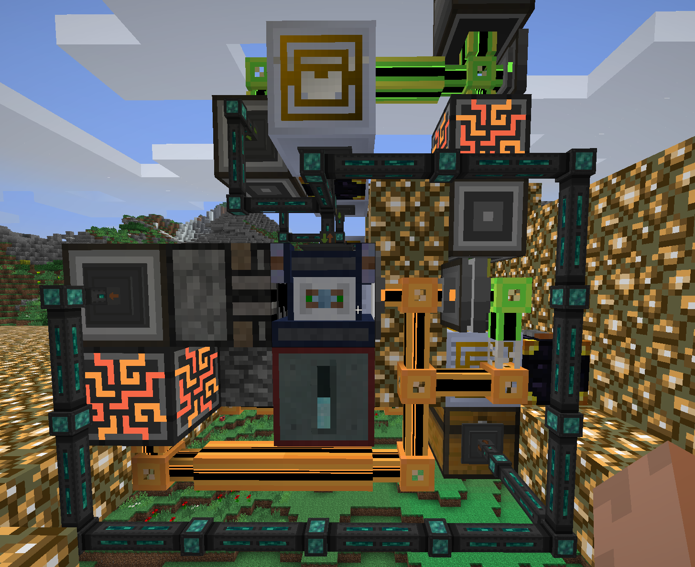
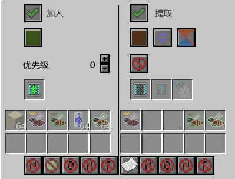
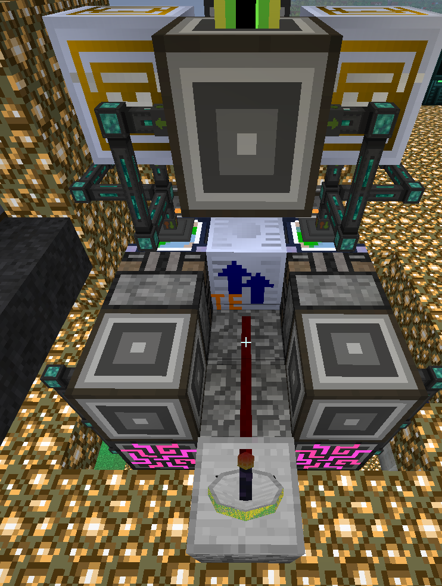
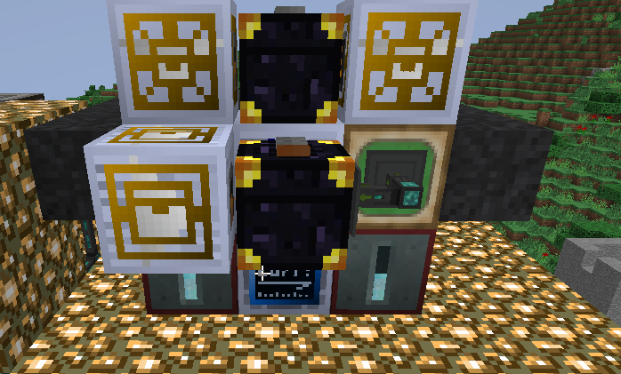
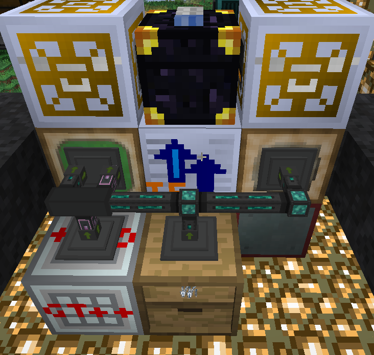
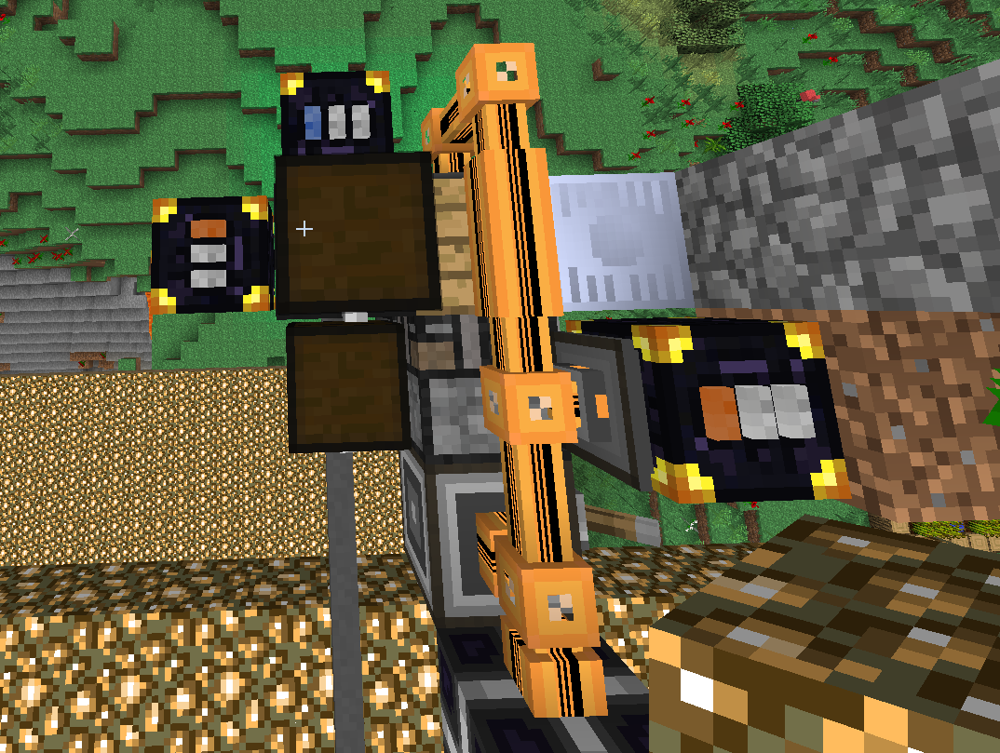
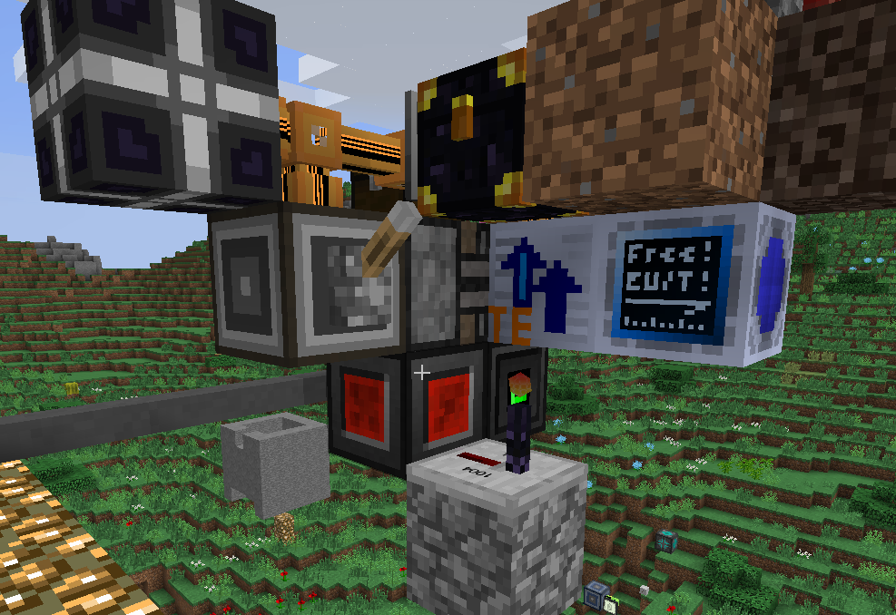
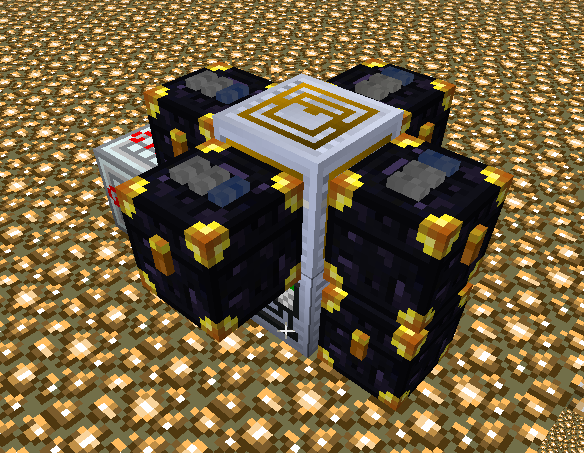

# BreederTron3000
The breeder of all breeders. Breeds from whatever you have in your bee chest up to the specified bee. Gene imprinting included but optional.

原作者: discord -> FrostyFire1

## HV+
需要准备以下物品:
1. 一套 OC 电脑
2. 适配器连接蜂箱/蜂箱组
3. 转运器
4. 4 个箱子（推荐至少两个大容量箱子装纯种雄蜂和“垃圾”）
>**警告：如果使用蜂箱组，适配器必须紧邻蜂箱组的中间(高度)方块之一。如果程序未检测到蜂箱组，拆掉蜂箱组重新放。**
5. 林业分析仪 或 GT 单块扫描仪（任意等级）
6. 雄蜂和 **始祖种** 公主蜂。所有蜜蜂都必须是纯种。程序不会识别蜂后。程序启动时自动扫描所有未扫描的蜜蜂。
   任何同时拥有雄蜂和公主蜂的品种，如果雄蜂数量不足 16 个，将自动繁殖到至少 16 个雄蜂。
>**注意：你可以在储存箱中放置任意品种的公主蜂。程序会在必要时将其转换为所需品种。**


推荐：
- 狂热框架 / 蜂箱组 (用于诱变)
- 任意用于防止突变的框架
- Witchery 的 季节变迁之酿 药水，用于修改生物群系
- 适应性调整器
- 提供优质基因的模板雄蜂（程序会将它们的基因压印到其他蜜蜂上）
- 世界加速器

### BreederTron3000 安装指南：
在 OC 电脑上运行以下命令：
```wget https://raw.githubusercontent.com/DayuanX/GTNH_OC_SCRIPTS/main/BreederTron3000/setup.lua && setup```

将 4 个箱子、蜂箱紧贴转运器，算上线缆会把转运器的6个面都用完。
首次启动时，你需要提供所有容器相对于转运器的方向：
1. 仓库 ("storage"), 用于储存所有纯种雄蜂和公主蜂 
2. 扫描仪 ("scanner"), 待扫描的蜜蜂会被放到这里，你需要把里面的蜜蜂拿去扫描, 可以用管道连进扫描仪
3. 输出 ("output"), 扫描仪扫描完的蜜蜂放回这里, 程序需要从这拿走蜜蜂
4. 垃圾箱 ("garbage")（这个不是真的垃圾桶，其实是杂物箱。程序在压印模板蜜蜂的基因或育种时会在这里寻找备用雄蜂。满了的时候要手动清理）

要运行 BreederTron3000，你必须提供模式和目标蜜蜂名作为参数。蜜蜂名称区分大小写。一般命令如下：

```BreederTron3000 programMode targetBee [OptionalArguments] [Flags]```

**可用模式：`breed` (育种)、`imprint` (基因压印) 和 `convert` (转换)**

育种模式将逐级育种出指定的品种。例如：
`BreederTron3000 breed 粘土` 将根据已有的雄蜂逐级育种到粘土蜂。

对于重名的蜜蜂，需要手动查看NEI获取正确的杂交路线，然后根据程序提示选择路线。

育种模式支持以下标志：

- `--noFinalImprint` - 使用后，目标蜜蜂的基因不会被模板基因替换（如果你想要这个蜜蜂提供的基因）。要使用此标志运行 breedertron，只需在命令末尾添加它。
- `--onlyFinalImprint` - 与 `--noFinalImprint` 完全相反。仅压印目标蜜蜂。如果与 `--noFinalImprint` 结合使用，则不会压印任何蜜蜂（不确定你为什么要这样做）。
- `--completionist` - 在每次成功育种后停止程序，以便你完成相关任务。完成任务后将蜜蜂放回储存箱，然后输入 ok 继续。如果你想要的蜜蜂对应的任务已经完成，就不需要这个标志。

压印模式会将模板基因压印到仓库中的每只蜜蜂上。除非你提供 TargetBee 参数，在这种情况下，它只会压印特定品种的蜜蜂。要在压印模式下运行程序，请运行：

`BreederTron3000 imprint`

转换模式将仓库中找到的第一个公主蜂转换为目标品种。(可选)支持 convertCount 作为参数来指定要制作的公主蜂数量。要运行：
`BreederTron3000 convert beeName [convertCount]`
转换模式支持 `--swarm` 标志。如果使用，会将仓库中所有公主蜂转换成目标品种。

### BreederTron3000 机器人模式
用来帮你放置蜜蜂突变所需的方块。
此模式需要在 OC 电脑中安装无线网卡（T2）
只需：
1. 用 OC 为硬盘装好系统, 然后执行
   `wget https://raw.githubusercontent.com/FrostyFire1/GTNH_OC_SCRIPTS/main/BreederTron3000/robotSetup.lua && robotSetup`
2. 组装一个 OC 机器人（必须有键盘、屏幕、无线网卡（推荐 T2）、步骤 1 中的硬盘、一个物品栏升级和一个物品栏控制器升级）。
3. 将机器人放置在面向你的 蜂箱/蜂箱组 突变方块的位置
4. 给它所有需要的突变用的方块和一个工具来拆除已经放置的方块 (推荐镐)
5. 运行命令 `robot`
记得在机器人旁边放一个充电器！

## LuV+ (新增内容)
适用于 LuV+ 的全自动蜜蜂育种，能够使用诱变机、压印机、适应性调整器自动培育完美蜜蜂。
与前述脚本的不同点是，将"扫描仪"箱子和"输出"箱子的功能进行扩展，为箱子中的每个格子分配一个功能，用末影箱在各个不同功能之间传输物品。"扫描仪"和"输出"末影箱的频道不能相同。最好不要占用这两个末影箱中的格子，避免影响程序运行。

### 安装
需要准备多套装置。示例中大量使用gt缓存器(电压不限)、机械臂(电压不限)、openblocks的方块采掘器(其他方块破坏器好像都不能用)。GT机械臂对格子的编号是 [0, 26]，后续编号均指0为基础的编号方式。

#### 适应性调整器
该装置需要满足以下要求：
1. 从"扫描仪末影箱"的特定格子接收待调整蜜蜂
2. 调整完的蜜蜂输出到"输出末影箱"的0号格子
3. 一套装置需要能够同时向适应性上下两个方向调整, 也即调整器内要同时有两种物品
4. 接收到红石信号(安装时`acclimatiserBreaker`方向的信号)时, 强制破坏调整器，使蜜蜂弹出，把蜜蜂放到"输出末影箱"的0号格子。然后自动放好调整器。

这样的装置需要两套：
1. 一套调整温度，从"扫描仪末影箱"的25号格子获取蜜蜂 (调整器内放烈焰棒/冰块)
2. 另外一套调整湿度，从"扫描仪末影箱"的23号格子获取蜜蜂 (调整器内放沙子/林业水罐)

示例:


1. 绿色网络/最上方接口提供耗材(烈焰棒/冰块/沙子/水罐), 由eio管道抽出
2. 缓存器后面是"扫描仪"末影箱，缓存器上贴机械臂从末影箱抽取特定格子的蜜蜂，再用eio导管运出来
3. 调整器从eio导管的绿色频道接收耗材和蜜蜂
4. eio导管的红色频道从采掘器后的接口/调整器中抽出调整完的蜜蜂输出到右下方箱子, 右方缓存器的底面安装机械臂把箱子中的蜜蜂抽入缓存器，缓存器的右边安装机械臂把蜜蜂输出到"输出"末影箱的0号格子
5. "橙色网络-存储总线 -> me接口-绿色网络"用于把破坏掉落的耗材塞回绿色网络



6. 可以通过eio的"限制物品过滤器"维持调整器内有两种耗材各一组；高级物品过滤器中忽略meta、忽略nbt，然后标注任意蜂后、雄蜂、公主蜂各一只即可通配蜜蜂。
7. 调整器右边是成型面板，标记调整器，调整器被破坏时可以立刻放置。 

8. 利用WR-CBE的无线红石，接收到信号时激活方块采掘器。

示例中使用zpm加速器128倍速，大概10秒的超时时间就能取得很好的效果。

#### 诱变机/压印机
该装置需要满足以下要求：
1. 从"扫描仪末影箱"的特定格子接收待调整蜜蜂, 诱变机对应21号格子，压印机对应22号格子
2. 诱变机处理完的蜜蜂/垃圾输出到"输出末影箱"的0号格子
3. 压印机处理完的蜜蜂/垃圾输出到"输出末影箱"的26号格子
4. 压印机中的基因模板最好只有品种留空

示例:



1. 左边被缓存器挡住的位置是压印机，右边是诱变机
2. 中间的缓存器上对着压印机贴机械臂，从3号位置抽取，可以直接抽出成品蜜蜂
3. 上面两个缓存器+机械臂是输入



4. 背面输入所需耗材。

#### 蜂箱
基本逻辑和原来的类似。

该装置需要满足以下要求：
1. 只能使用小蜂箱
2. 接收到`apiaryBreaker`面的信号时，激活采掘器，破坏蜂箱，弹出公主蜂。然后自动放好蜂箱。

示例:



1. 蜂箱上面是成型面板，蜂箱被破坏时会立刻再放出来，优先级调高。
2. 右侧存储面板以低优先级连接"输出末影箱"，破坏时会把蜂后放进去。



3. 示例中的 `apiaryBreaker` 面是上面，直接控制采掘器。那个无线发射器是给适应性调整器模块用的。

#### 扫描仪
该装置需要满足以下要求：
1. 从"扫描仪末影箱"的前5格(0-4)接收待扫描蜜蜂，注意不能抽取全部格子，否则会影响其他模块运行
2. 处理完的蜜蜂输出到"输出末影箱", 格子不限

示例:


缓存器的四面贴机械臂分别从一个格子抽取蜜蜂，缓存器将蜜蜂直接输出到扫描仪中, 扫描仪扫完将蜜蜂直接弹出到"输出末影箱"中。

#### 安装指令
与原脚本一致，但是配置时注意不能乱填蜂箱温度，并且要确认使用适应性调整器。

### 使用
`breed` 模式下附加 `--mutatron` 标志即可启用诱变机。例:
```bash
BreederTron3000 breed 能量 --mutatron
```
即可使用诱变机从已有雄蜂开始逐级诱变出能量蜂。

### 可配置项
1. `lib/config.lua` 中可以调整 `config.forceImprintGenes` 以强制在遇见某些特定基因时直接压印蜂后/公主蜂，目前默认配置了蜜蜂特殊效果中的雷击/流星/辐射，避免蜜蜂摧毁基地。注意不要滥用这个功能，直接压印非常容易把蜜蜂压死，消耗公主蜂的速度非常快。

2. 安装时的配置分散在 `acclimatiserConfig.lua` 和 `sideConfig.lua` 中。

## 蜜蜂中英文对照表
服务器环境可能默认是英文的，输入中文名无法启动育种。在这查表，用英文名试试？
<details>

|中文名|英文名|uid|
|-|-|-|
|硅晶|Silicon|magicbees.speciesSilicon|
|红色|Maroon|extrabees.species.red|
|辉钴|Cobalt|magicbees.speciesCobalt|
|冰封|Absolute|extrabees.species.freezing|
|柏油|Tarry|extrabees.species.creosote|
|磷|Phosphorus|gregtech.bee.speciesPhosphorus|
|酸化|Acidic|extrabees.species.acidic|
|星尘|Stardust|gregtech.bee.speciesStardust|
|高尚|Noble|forestry.speciesNoble|
|联结|Nexus|magicbees.speciesTCNexus|
|冥王星|Pluto|gregtech.bee.speciesPluto|
|恶龙|Draconic|magicbees.speciesDraconic|
|博学|Scholarly|magicbees.speciesScholarly|
|符文|Rune|gregtech.bee.speciesRune|
|坚毅|Robust|extrabees.species.granite|
|普天同庆|Celebratory|extrabees.species.celebratory|
|欢乐|Merry|forestry.speciesMerry|
|深铅|Ledox|gregtech.bee.speciesLedox|
|逗逼|Derpious|gendustry.bee.derpious|
|兰波顿|Lapotron|gregtech.bee.speciesLapotron|
|激动|Excited|extrabees.species.excited|
|饕餮|Ravening|magicbees.speciesTCHungry|
|纯色|Caelestis|gregtech.bee.speciesCaelestis|
|龙|Drake|gregtech.bee.speciesDrake|
|织女座|Vega|gregtech.bee.speciesVega|
|愤怒|Furious|extrabees.species.tempered|
|半人马|Centauri|gregtech.bee.speciesCentauri|
|混沌|Chaos|gregtech.bee.speciesChaos|
|烈焰之炽焱|Pyrotheum|gregtech.bee.speciesPyrotheum|
|橙色|Amber|extrabees.species.orange|
|黑色|Black|gendustry.bee.black|
|冰雪女王|Snow Queen|gregtech.bee.speciesSnowqueen|
|灰色|Slate|extrabees.species.gray|
|魂魄|Soul|magicbees.speciesSoul|
|天卫五|Miranda|gregtech.bee.speciesMiranda|
|传染|Infectious|extrabees.species.infectious|
|钢铁|Steel|gregtech.bee.speciesSteel|
|充能合金|Energetic Alloy|gregtech.bee.speciesEnergeticalloy|
|冻结|Frigid|extrabees.species.artic|
|银辉|Shining|extrabees.species.silver|
|花开|Blossom|magicbees.speciesBotBlossom|
|棕色|Sepia|extrabees.species.brown|
|火焰精华|Fire Essence|gregtech.bee.speciesFireessence|
|土|Earth|gregtech.bee.speciesEarth|
|超能硅岩|Naquadria|gregtech.bee.speciesNaquadria|
|树脂|Resinous|extrabees.species.resin|
|终末|Endium|gregtech.bee.speciesEndium|
|报仇|Vengeful|forestry.speciesVengeful|
|蠹虫|Silverfish|gregtech.bee.speciesSilverfish|
|花海|Floral|magicbees.speciesBotFloral|
|黄金|Auric|magicbees.speciesGold|
|九头蛇|Hydra|gregtech.bee.speciesHydra|
|复兴|Rejuvenating|magicbees.speciesTCRejuvenating|
|云母|Mica|gregtech.bee.speciesMica|
|暮色恶魂|Ur Ghast|gregtech.bee.speciesUrghast|
|中子|Neutronium|gregtech.bee.speciesNeutronium|
|凯芙拉|Kevlar|gregtech.bee.speciesKevlar|
|水|Watery|magicbees.speciesWatery|
|不稳定金属|Unstable|gregtech.bee.speciesDivided|
|诡隐|Skulking|magicbees.speciesSkulking|
|磷化|Apatine|magicbees.speciesApatite|
|咖啡|Caffeinated|extrabees.species.coffee|
|腐化|Tainted|gregtech.bee.speciesTainted|
|幽灵|Spectral|forestry.speciesSpectral|
|淡灰色|Light Gray|gendustry.bee.silver|
|含油|Oily|extrabees.species.oil|
|巴纳德E|BarnardaE|gregtech.bee.speciesBarnardae|
|绿宝石|Emerald|gregtech.bee.speciesEmerald|
|奥秘|Mysterious|magicbees.speciesMysterious|
|田园|Rural|forestry.speciesRural|
|巴纳德F|BarnardaF|gregtech.bee.speciesBarnardaf|
|粘土|Clay|gregtech.bee.speciesClay|
|铁锈|Rusty|extrabees.species.iron|
|钛|Titanium|gregtech.bee.speciesTitanium|
|绿色|Green|gendustry.bee.green|
|铂|Platinum|gregtech.bee.speciesPlatinum|
|海藻|Seaweed|gregtech.bee.speciesSeaweed|
|遗忘|Abandoned|magicbees.speciesAbandoned|
|龙血|Dragonblood|gtpp.bee.speciesDragon Blood|
|秘银|Mithril|gregtech.bee.speciesMithril|
|木卫二|Europa|gregtech.bee.speciesEuropa|
|蓝石|Electrotine|gregtech.bee.speciesElectrotine|
|冰河|Glacial|forestry.speciesGlacial|
|萤石|Glowstone|gregtech.bee.speciesGlowstone|
|伊甸|Edenic|forestry.speciesEdenic|
|河流|River|extrabees.species.river|
|胶质|Glutinous|extrabees.species.glutinous|
|无尽催化剂|Infinity Catalyst|gregtech.bee.speciesInfinitycatalyst|
|粘性树脂|Sticky Resin|gregtech.bee.speciesStickyresin|
|黑色|Ebony|extrabees.species.black|
|白银|Argentum|magicbees.speciesSilver|
|天石|Skystone|magicbees.speciesAESkystone|
|青色|Cyan|gendustry.bee.cyan|
|魅惑|Charmed|magicbees.speciesCharmed|
|生根|Rooted|magicbees.speciesBotRooted|
|粉色|Pink|gendustry.bee.pink|
|导电铁|Conductive Iron|gregtech.bee.speciesConductiveiron|
|翡翠|Jaded|extrabees.species.jaded|
|恶意|Malicious|extrabees.species.malicious|
|牛奶|Bovine|extrabees.species.milk|
|玄钢|Dark Steel|gregtech.bee.speciesDarksteel|
|火山|Volcanic|extrabees.species.volcanic|
|节俭|Frugal|forestry.speciesFrugal|
|活力十足|Energetic|extrabees.species.energetic|
|稼穑|Farmerly|forestry.speciesFarmerly|
|幽魂|Ghastly|magicbees.speciesGhastly|
|黄石榴石|Yellow Garnet|gregtech.bee.speciesYellowgarnet|
|蓝色|Blue|gendustry.bee.blue|
|野兔|Leporine|forestry.speciesLeporine|
|镍|Nickel|gregtech.bee.speciesNickel|
|锡灰|Tarnished|extrabees.species.tin|
|风|Air|gregtech.bee.speciesAir|
|原始|Primeval|extrabees.species.primeval|
|黄色|Yellow|gendustry.bee.yellow|
|火石|Firestone|gregtech.bee.speciesFirestone|
|鲸鱼座T星E|TCetiE|gregtech.bee.speciesTcetie|
|流水|Aqua|magicbees.speciesTCWater|
|记恨|Vindictive|forestry.speciesVindictive|
|痛苦|Gnawing|extrabees.species.gnawing|
|冰晶石|Cryolite|gregtech.bee.speciesCryolite|
|苦行|Austere|forestry.speciesAustere|
|贵族|Lordly|magicbees.speciesLordly|
|铬|Chrome|gregtech.bee.speciesChrome|
|三元金属|Trinium|gregtech.bee.speciesTrinium|
|荒凉|Desolate|extrabees.species.desolate|
|钍|Thorium|gregtech.bee.speciesThorium|
|海象|Walrus|gregtech.bee.speciesWalrus|
|粉色|Lavender|extrabees.species.pink|
|砷|Arsenic|gregtech.bee.speciesArsenic|
|铟|Indium|gregtech.bee.speciesIndium|
|紫铜|Cuprum|magicbees.speciesCopper|
|成熟|Ripening|extrabees.species.ripening|
|妊神星|Haume|gregtech.bee.speciesHaumea|
|爬行者|Creepy|extrabees.species.creeper|
|品红色|Magenta|gendustry.bee.magenta|
|轻灵|Wispy|magicbees.speciesTCWispy|
|狂喜|Ecstatic|extrabees.species.ecstatic|
|机械师|Machinist|gregtech.bee.speciesMachinist|
|生长|Growing|extrabees.species.growing|
|不倦|Unweary|forestry.speciesUnweary|
|肥料|Fertilizer|gregtech.bee.speciesFertilizer|
|谷神星|Ceres|gregtech.bee.speciesCeres|
|核能|Nuclear|extrabees.species.nuclear|
|遁世|Hermitic|forestry.speciesHermitic|
|炸药|Explosive|gregtech.bee.speciesExplosive|
|蕴魔|Enchanted|magicbees.speciesEnchanted|
|钚|Plutonium|gregtech.bee.speciesPlutonium|
|化石|Fossilised|extrabees.species.coal|
|史前|Prehistoric|extrabees.species.prehistoric|
|淡蓝|Azure|extrabees.species.lightblue|
|瞬息|Timely|magicbees.speciesTimely|
|蜕变|Transmuting|magicbees.speciesTransmuting|
|怒视|Glowering|extrabees.species.glowstone|
|铅|Lead|gregtech.bee.speciesLead|
|火卫一|Phobos|gregtech.bee.speciesPhobos|
|含镍|Lustered|extrabees.species.nickel|
|琥珀|Amber|gregtech.bee.speciesAmber|
|神秘|Mystical|extrabees.species.mystical|
|农庄|Farmed|extrabees.species.farm|
|黄铀|Yellorium|extrabees.species.yellorium|
|硅岩|Naquadah|gregtech.bee.speciesNaquadah|
|腐蚀|Corrosive|extrabees.species.corrosive|
|灰色|Gray|gendustry.bee.gray|
|龙之精华|Dragon Essence|gregtech.bee.speciesDragonessence|
|弹性|Resilient|extrabees.species.mineral|
|精炼|Refined|extrabees.species.fuel|
|壮牛|Beefy|magicbees.speciesTCBeef|
|铕|Europium|gregtech.bee.speciesEuropium|
|氩|Argon|gregtech.bee.speciesArgon|
|土|Earthen|magicbees.speciesEarthen|
|苛性|Caustic|extrabees.species.caustic|
|木卫三|Ganymed|gregtech.bee.speciesGanymede|
|泥土|Solum|magicbees.speciesTCEarth|
|潮湿|Damp|extrabees.species.swamp|
|氙|Xenon|gregtech.bee.speciesXenon|
|博士|Doctoral|magicbees.speciesDoctoral|
|火卫二|Deimos|gregtech.bee.speciesDeimos|
|红石榴石|Red Garnet|gregtech.bee.speciesRedgarnet|
|火星|Mars|gregtech.bee.speciesMars|
|泥泞|Miry|forestry.speciesMiry|
|风|Windy|magicbees.speciesWindy|
|金|Gold|gregtech.bee.speciesGold|
|下界碎片|Nether Shard|gregtech.bee.speciesNethershard|
|水果|Fruity|extrabees.species.fruit|
|复仇|Avenging|forestry.speciesAvenging|
|超能|Supernatural|magicbees.speciesSupernatural|
|橙色|Orange|gendustry.bee.orange|
|靛蓝|Indigo|extrabees.species.purple|
|遗迹|Relic|extrabees.species.relic|
|末影碎片|Ender Shard|gregtech.bee.speciesEndshard|
|铀|Uranium|gregtech.bee.speciesUranium|
|奥术碎片|Arcane Shard|gregtech.bee.speciesArcaneshards|
|红石|Redstone|gregtech.bee.speciesRedstone|
|隐形|Invisible|magicbees.speciesInvisible|
|农耕|Agrarian|forestry.speciesAgrarian|
|寻常|Common|forestry.speciesCommon|
|鲸鱼座T星|TCeti|gregtech.bee.speciesTceti|
|墨污|Stained|extrabees.species.ink|
|海卫八|Proteus|gregtech.bee.speciesProteus|
|宇宙中子态素|Cosmic Neutronium|gregtech.bee.speciesCosmicneutronium|
|海卫一|Triton|gregtech.bee.speciesTriton|
|硫|Sulfur|gregtech.bee.speciesSulfur|
|秩序|Order|gregtech.bee.speciesOrder|
|充能|Empowering|magicbees.speciesTCEmpowering|
|蓝色|Prussian|extrabees.species.blue|
|力量|Force|gtpp.bee.speciesForce|
|干旱|Arid|extrabees.species.arid|
|异国|Exotic|forestry.speciesExotic|
|粘液球|Slimeball|gregtech.bee.speciesSlimeball|
|末影(te)|Enderium|gregtech.bee.speciesEnderium|
|土卫六|Titan|gregtech.bee.speciesTitan|
|镅|Americium|gregtech.bee.speciesAmericium|
|邪恶|Sinister|forestry.speciesSinister|
|量子|Quantium|gregtech.bee.speciesQuantium|
|紫色|Purple|gendustry.bee.purple|
|金闪|Glittering|extrabees.species.gold|
|恶意|Spiteful|magicbees.speciesSpiteful|
|衰败|Decaying|extrabees.species.rotten|
|娜迦|Naga|gregtech.bee.speciesNaga|
|定型|Certus|magicbees.speciesCertus|
|品红|Fuchsia|extrabees.species.magenta|
|土卫二|Enceladus|gregtech.bee.speciesEnceladus|
|白色|White|gendustry.bee.white|
|黑暗|Darkened|extrabees.species.darkened|
|铁|Iron|gregtech.bee.speciesIron|
|磷灰石|Apatite|gregtech.bee.speciesApatite|
|月球|Moon|gregtech.bee.speciesMoon|
|基岩|Bedrockium|gregtech.bee.speciesBedrockium|
|梦境|Dreaming|magicbees.speciesBotDreaming|
|土星|Saturn|gregtech.bee.speciesSaturn|
|怒尸|Brainy|magicbees.speciesTCBrainy|
|黄绿|Lime|extrabees.species.limegreen|
|钨|Tungsten|gregtech.bee.speciesTungsten|
|锌|Zinc|gregtech.bee.speciesZinc|
|三明治|Sandwich|gregtech.bee.speciesSandwich|
|盐|Salt|gregtech.bee.speciesSalty|
|野格|Jaegermeister|gregtech.bee.speciesJaegermeister|
|蓝宝石|Sapphire|gregtech.bee.speciesSapphire|
|钻石|Diamandi|magicbees.speciesDiamond|
|异常|Abnormal|extrabees.species.unusual|
|蓝钚|Blutonium|extrabees.species.blutonium|
|红色|Red|gendustry.bee.red|
|氖|Neon|gregtech.bee.speciesNeon|
|铅质|Leaden|extrabees.species.lead|
|茶|Tea|gregtech.bee.speciesTea|
|末影人头|Enderman Head|gregtech.bee.speciesEndermanhead|
|钻石|Diamond|extrabees.species.diamond|
|黄绿色|Lime|gendustry.bee.lime|
|咒波|Flux|magicbees.speciesTCFlux|
|淡蓝色|Light Blue|gendustry.bee.lightblue|
|氟|Fluorine|gregtech.bee.speciesFluorine|
|钕|Neodymium|gregtech.bee.speciesNeodymium|
|灼热|Ignis|magicbees.speciesTCFire|
|善变|Mutable|magicbees.speciesMutable|
|末影粉末|End Dust|gregtech.bee.speciesEnddust|
|忍耐|Tolerant|extrabees.species.stone|
|蓝宝石|Sapphire|extrabees.species.sapphire|
|凋零|Withering|magicbees.speciesWithering|
|宝石|Esmeraldi|magicbees.speciesEmerald|
|纯净|Pure|magicbees.speciesTCPure|
|感知|Aware|magicbees.speciesAware|
|脉冲合金|Vibrant Alloy|gregtech.bee.speciesVibrantalloy|
|怪异|Eldritch|magicbees.speciesEldritch|
|黑钚|Black Plutonium|gregtech.bee.speciesBlackplutonium|
|鸟神星|MakeMake|gregtech.bee.speciesMakemake|
|星辰银|Astral Silver|gregtech.bee.speciesAstralsilver|
|极寒之凛冰|Cryotheum|gregtech.bee.speciesCryotheum|
|水星|Mercury|gregtech.bee.speciesMercury|
|氮|Nitrogen|gregtech.bee.speciesNitrogen|
|Chad|Chad|extrabees.species.chad|
|催眠|Somnolent|magicbees.speciesBotSomnolent|
|氦|Helium|gregtech.bee.speciesHelium|
|无尽|Infinity|gregtech.bee.speciesInfinity|
|天王星|Uranus|gregtech.bee.speciesUranus|
|钻石|Diamond|gregtech.bee.speciesDiamond|
|神秘碎片|Thaumic Shards|gregtech.bee.speciesThaumiumshard|
|分解|Decomposing|extrabees.species.decomposing|
|铂金|Valuable|extrabees.species.platinum|
|赛特斯|Certus|gregtech.bee.speciesCertus|
|铜绿|Corroded|extrabees.species.copper|
|深渊|Abyssal|extrabees.species.abyss|
|红色合金|Red Alloy|gregtech.bee.speciesRedalloy|
|朴实|Chaotic|magicbees.speciesTCChaos|
|剧毒|Virulent|extrabees.species.virulent|
|巴纳德|Barnarda|gregtech.bee.speciesBarnarda|
|绿色|Natural|extrabees.species.green|
|暗影金属|Shadow Metal|gregtech.bee.speciesShadowmetal|
|冒险|Hazardous|extrabees.species.hazardous|
|亮铝|Aluminum|magicbees.speciesAluminum|
|铝|Aluminium|gregtech.bee.speciesAluminium|
|锇|Osmium|gregtech.bee.speciesOsmium|
|深空秘银|Mytryl|gregtech.bee.speciesMytryl|
|稀土|Rare Earth|gregtech.bee.speciesRareearth|
|憎恶|Hateful|magicbees.speciesHateful|
|织女B|VegaB|gregtech.bee.speciesVegab|
|木卫四冰|Callisto Ice|gregtech.bee.speciesCallistoice|
|家禽|Poultry|magicbees.speciesTCChicken|
|镀锌|Galvanized|extrabees.species.zinc|
|海洋|Ocean|extrabees.species.ocean|
|黄色|Saffron|extrabees.species.yellow|
|幻影|Phantasmal|forestry.speciesPhantasmal|
|蓝晶|Cyanite|extrabees.species.cyanite|
|淡灰|Ashen|extrabees.species.lightgray|
|黏液|Sticky|extrabees.species.sticky|
|煤|Coal|gregtech.bee.speciesCoal|
|学徒|Pupil|magicbees.speciesPupil|
|浮渣|Scummy|computronics.speciesScummy|
|骷髅|Skeletal|extrabees.species.bone|
|氧|Oxygen|gregtech.bee.speciesOxygen|
|空间|Spatial|extrabees.species.spatial|
|木星|Jupiter|gregtech.bee.speciesJupiter|
|不稳|Unstable|extrabees.species.unstable|
|锂|Lithium|gregtech.bee.speciesLithium|
|福鲁伊克斯|Fluix|magicbees.speciesFluix|
|红石合金|Redstone Alloy|gregtech.bee.speciesRedstonealloy|
|秘晶|Thauminite|gregtech.bee.speciesThauminite|
|木卫四|Callisto|gregtech.bee.speciesCallisto|
|福鲁伊克斯|Fluix|gregtech.bee.speciesFluix|
|源质|Essentia|gregtech.bee.speciesEssentia|
|阿迪特|Ardite|magicbees.speciesArdite|
|灰铁|Ferrous|magicbees.speciesIron|
|镥|Lutetium|gregtech.bee.speciesLutetium|
|兴旺|Thriving|extrabees.species.thriving|
|英雄|Heroic|forestry.speciesHeroic|
|青金石|Lapis|gregtech.bee.speciesLapis|
|巴纳德C|BarnardaC|gregtech.bee.speciesBarnardac|
|玛玉灵|Manyullyn|magicbees.speciesManyullyn|
|源质|Essentia|magicbees.speciesTCEssentia|
|金星|Venus|gregtech.bee.speciesVenus|
|白锡|Stannum|magicbees.speciesTin|
|荒芜|Barren|extrabees.species.barren|
|石油|Oil|gregtech.bee.speciesOil|
|铜|Copper|gregtech.bee.speciesCopper|
|水银|Quicksilver|gregtech.bee.speciesQuicksilver|
|蜘蛛|Spidery|magicbees.speciesSpidery|
|归隐|Secluded|forestry.speciesSecluded|
|氢|Hydrogen|gregtech.bee.speciesHydrogen|
|绿宝石|Emerald|extrabees.species.emerald|
|天卫四|Oberon|gregtech.bee.speciesOberon|
|陨铁|Meteoric Iron|gregtech.bee.speciesMeteoriciron|
|骏马|Neighsayer|magicbees.speciesHorse|
|古代|Ancient|extrabees.species.ancient|
|敬业|Industrious|forestry.speciesIndustrious|
|锡|Tin|gregtech.bee.speciesTin|
|阳光化合物|Sunnarium|gregtech.bee.speciesSunnarium|
|黏性|Viscous|extrabees.species.viscous|
|橄榄石|Olivine|gregtech.bee.speciesOlivine|
|灵气|Aer|magicbees.speciesTCAir|
|泥淖|Sodden|extrabees.species.boggy|
|恶魔|Demonic|forestry.speciesDemonic|
|魔晶|D-O-B|gregtech.bee.speciesDob|
|能量|Energy|gregtech.bee.speciesEnergy|
|氪|Krypton|gregtech.bee.speciesKrypton|
|海王星|Neptune|gregtech.bee.speciesNeptune|
|银|Silver|gregtech.bee.speciesSilver|
|猪啰|Porcine|magicbees.speciesTCPork|
|不明液体|Unknown Liquid|gregtech.bee.speciesUnknownwater|
|庄严|Majestic|forestry.speciesMajestic|
|量子|Quantum|extrabees.species.quantum|
|凋灵|Wither|gregtech.bee.speciesSparkeling|
|崩溃|Crumbling|magicbees.speciesCrumbling|
|橡胶|Elastic|extrabees.species.latex|
|红宝石|Ruby|gregtech.bee.speciesRuby|
|魔力|Vis|magicbees.speciesTCVis|
|棕色|Brown|gendustry.bee.brown|
|神秘水晶|Mysterious Crystal|gregtech.bee.speciesMysteriouscrystal|
|肥羊|Sheepish|magicbees.speciesSheepish|
|Big Bad|Big Bad|magicbees.speciesBigBad|
|捣蛋|Tricky|forestry.speciesTricky|
|发酵|Fermented|extrabees.species.alcohol|
|田野|Cultivated|forestry.speciesCultivated|
|青金石|Lapis|extrabees.species.lapis|
|脉冲铁|Pulsating Iron|gregtech.bee.speciesPulsatingiron|
|外质|Ectoplasma|gregtech.bee.speciesEctoplasma|
|沼泽|Boggy|forestry.speciesBoggy|
|冷却液|Coolant|gregtech.bee.speciesCoolant|
|微醺|Tipsy|forestry.speciesTipsy|
|帝皇|Imperial|forestry.speciesImperial|
|黑铅|Plumbum|magicbees.speciesLead|
|玄奥|Esoteric|magicbees.speciesEsoteric|
|奥能|Arcane|magicbees.speciesArcane|
|甜美|Sweetened|extrabees.species.sweet|
|注魔金|Infused Gold|gregtech.bee.speciesInfusedgold|
|以太|Ethereal|magicbees.speciesEthereal|
|虚空|Void|magicbees.speciesTCVoid|
|青色|Turquoise|extrabees.species.cyan|
|巫妖|Lich|gregtech.bee.speciesLich|
|木卫一|Io|gregtech.bee.speciesIo|
|世界盐|Salis Mundus|gregtech.bee.speciesSalismundus|
|红宝石|Ruby|extrabees.species.ruby|
|火蝠|Batty|magicbees.speciesTCBatty|
|半人马α|aCentauri|gregtech.bee.speciesAcentauri|
|灰烬|Ash|gregtech.bee.speciesAsh|
|精神|Spirit|magicbees.speciesSpirit|
|锰|Manganese|gregtech.bee.speciesManganese|
|菌类|Fungal|extrabees.species.fungal|
|泥炭|Peat|gregtech.bee.speciesPeat|
|宇宙|Space|gregtech.bee.speciesSpace|
|水|Water|gregtech.bee.speciesWater|
|白色|Bleached|extrabees.species.white|
|铱|Iridium|gregtech.bee.speciesIridium|
|戴斯|Desh|gregtech.bee.speciesDesh|
|不锈钢|Stainless Steel|gregtech.bee.speciesStainlesssteel|
|盛开|Blooming|extrabees.species.blooming|
|阴影|Shadowed|extrabees.species.shadow|
|奥利哈钢|Oriharukon|gregtech.bee.speciesOriharukon|
|残忍|Fiendish|forestry.speciesFiendish|
|无名|Nameless|magicbees.speciesNameless|
|野猫|Catty|magicbees.speciesCatty|
|含糖|Sugary|extrabees.species.sugar|
|火|Fire|gregtech.bee.speciesFire|
|神秘尘|Thaumium Dust|gregtech.bee.speciesThaumiumdust|
|勤奋|Diligent|forestry.speciesDiligent|
|专家|Savant|magicbees.speciesSavant|
|闷烧|Smouldering|magicbees.speciesSmouldering|
|奇术|Ordered|magicbees.speciesTCOrder|
|分馏|Distilled|extrabees.species.distilled|
|火|Firey|magicbees.speciesFirey|
|绝望|Forlorn|magicbees.speciesForlorn|
|严寒|Icy|forestry.speciesIcy|
|磁钢|Electrical Steel|gregtech.bee.speciesElectricalsteel|
</details>
